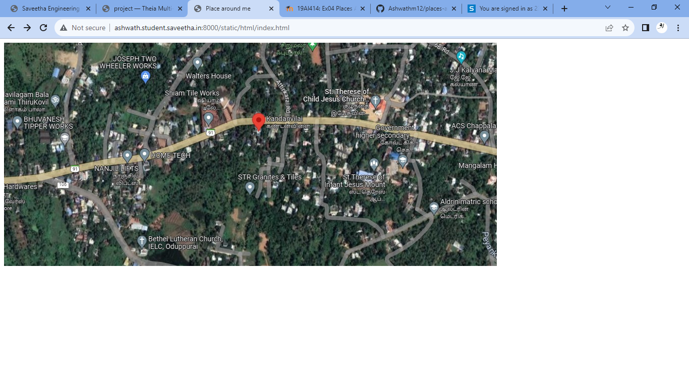
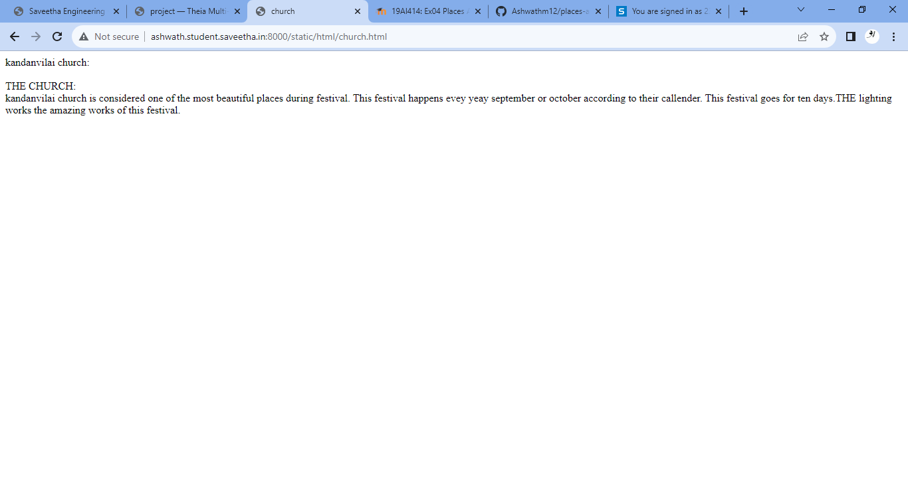
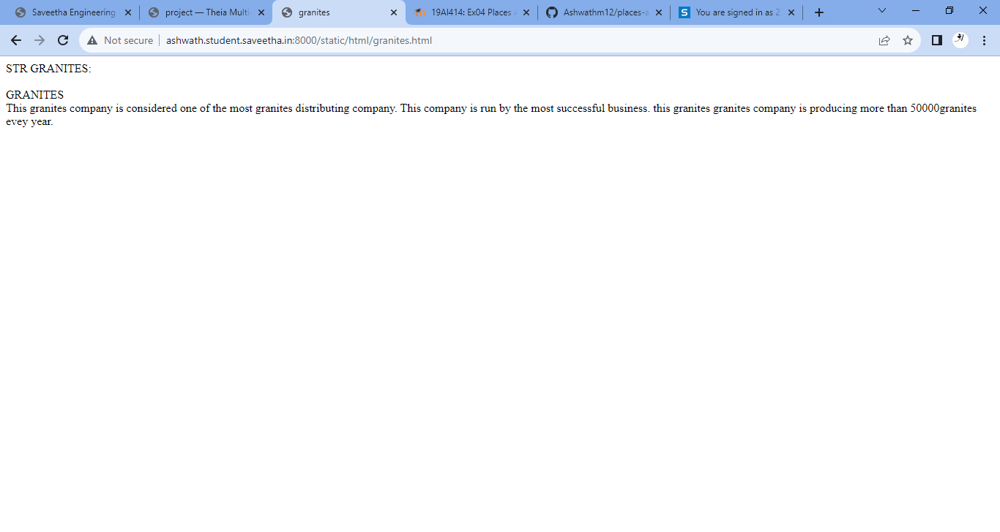
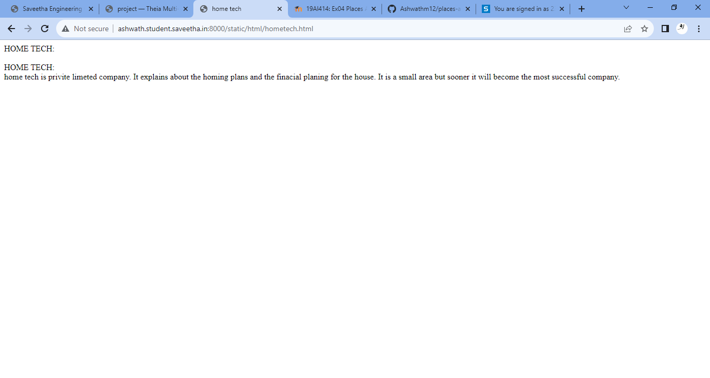
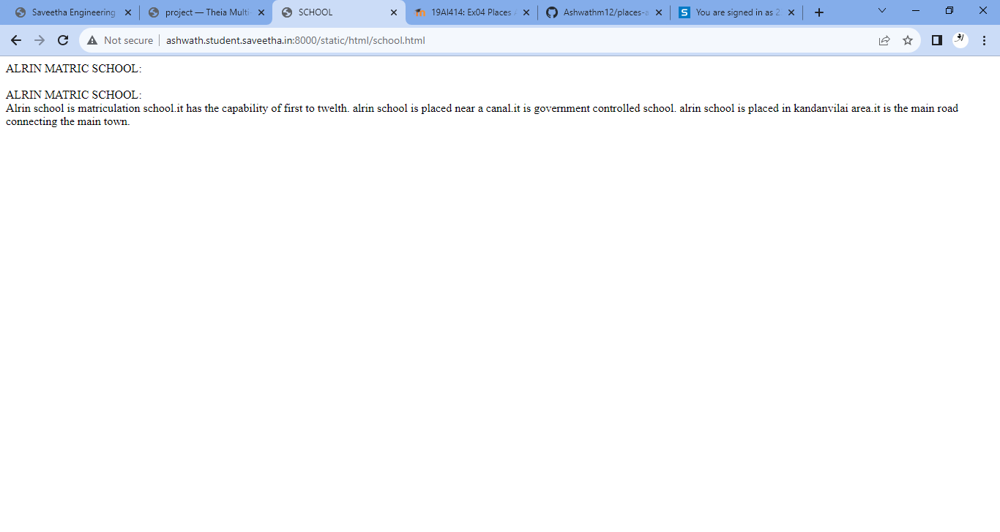
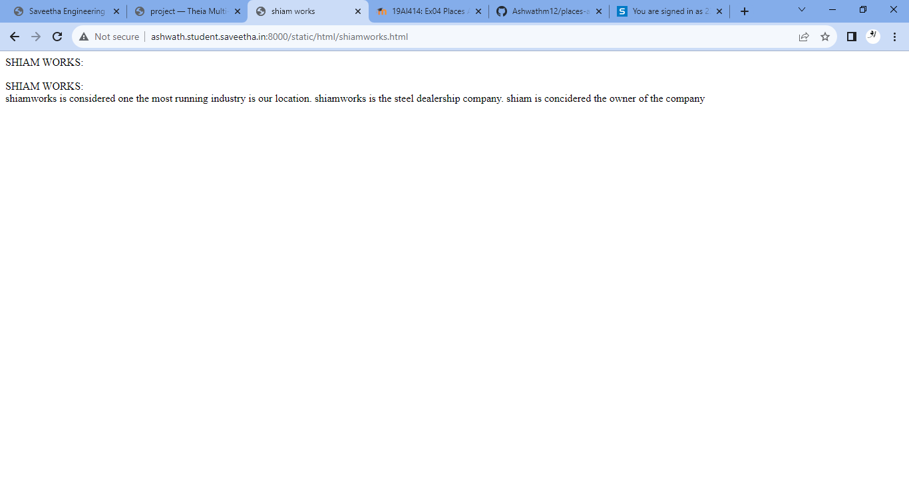

# Places Around Me
## AIM:
To develop a website to display details about the places around my house.

## Design Steps:

### Step 1:
clone the github repository into theria IDE.

### Step 2:
create a new django project

### step 3:
write the needed HTML code.

### step 4:
run the Django server and execute the HTML code.

## Code:
```
index.html:
<!DOCTYPE html>
<html>
<head>
    <title>Place around me</title>
</head>
<body>

<map name="image-maps-2023-07-24-055332" id="ImageMapsCom-image-maps-2023-07-24-055332">
<area  alt="" title="church" href="church.html" shape="rect" coords="710,96,760,146" style="outline:none;" target="_self"     />
<area  alt="" title="granites" href="granites.html" shape="rect" coords="468,264,527,316" style="outline:none;" target="_self"     />
<area  alt="" title="shiamworks" href="shiamworks.html" shape="rect" coords="368,120,434,176" style="outline:none;" target="_self"     />
<area  alt="" title="hometech" href="hometech.html" shape="rect" coords="261,206,327,262" style="outline:none;" target="_self"     />
<area  alt="" title="school" href="school.html" shape="rect" coords="831,308,897,364" style="outline:none;" target="_self"     />
<area shape="rect" coords="975,442,977,444" alt="Image Map" style="outline:none;" title="Image Map" href="https://www.image-maps.com/" />
</map>
</body>
</html>

church.html:
<!DOCTYPE html>
<html>
    <head>
        <title>church</title>
    </head>
    <body>
        kandanvilai church:
        <br>
        <br>
        THE CHURCH:
        <br>
        kandanvilai church is considered one of the most beautiful places during festival.
        This festival happens evey yeay september or october according to their callender.
        This festival goes for ten days.THE lighting works the amazing works of this festival.
        

    </body>
</html>

granites.html:
<!DOCTYPE html>
<html>
    <head>
        <title>granites</title>
    </head>
    <body>
        STR GRANITES:
        <br>
        <br>
        GRANITES
        <br>
        This granites company is considered one of the most granites distributing company.
        This company is run by the most successful business.
        this granites granites company is producing more than 50000granites evey year.
        </body>
</html>

hometech.html:
<!DOCTYPE html>
<html>
    <head>
        <title>home tech</title>
    </head>
    <body>
        HOME TECH:
        <br>
        <br>
        HOME TECH:
        <br>
        home tech is privite limeted company.
        It explains about the homing plans and the finacial planing for the house.
        It is a small area but sooner it will become the most successful company.
        

    </body>
</html>

school.html:
<!DOCTYPE html>
<html>
    <head>
        <title>SCHOOL</title>
    </head>
    <body>
        ALRIN MATRIC SCHOOL:
        <br>
        <br>
        ALRIN MATRIC SCHOOL:
        <br>
        Alrin school is matriculation school.it has the capability of first to twelth.
        alrin school is placed near a canal.it is government controlled school.
        alrin school is placed in kandanvilai area.it is the main road connecting the main town. 
        

    </body>
</html>

shiamworks.html:
<!DOCTYPE html>
<html>
    <head>
        <title>shiam works</title>
    </head>
    <body>
        SHIAM WORKS:
        <br>
        <br>
        SHIAM WORKS:
        <br>
        shiamworks is considered one the most running industry is our location.
        shiamworks is the steel dealership company.
        shiam is concidered the owner of the company
        

    </body>
</html>
```

## Output:












## Result:
The program is executed Successfully.